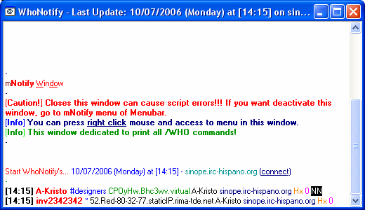

mIRC Add-ons 
============= 
by Joan Alba Maldonado (joanalbamaldonadoNO_SPAM_PLEASE AT gmail DOT com, without NO_SPAM_PLEASE)

Different add-ons for mIRC.

Version: different versions 
- Date: 1998 to 2001 (approximately)

## Description

Different add-ons for mIRC, the most famous IRC client.

_mNotify_ 0.96b (3rd June 2001): improves and enhances the "notify" function. Configurable.

_Nickah_ 0.05 (13th January 2001): configurable nick completion.

_PolishKill_ 1.00b (11th January 2001): lets you configure actions for users who uses some server-assigned names.

_FastMSG_ 0.20b (9th January 2001): reproduces a sound and opens a window with a message that can be sent to you through CTCP. Configurable

_AwaYeah_ 0.25b (19th May 2001): improves and enhances the "away" function with different things including sending an SMS to your phone. Includes FastMSG 0.20b. Needs SmS CoNTRoLeR (with SmS Sender 2.2 by hPm) by |-FaiR-| (not included). Configurable.

_aXpect_ 0.10b (16th December 2001): improves mIRC visual aspect and also reacts to desired words by performing chosen actions. Configurable.

_FileInfo_ 0.25b (29th November 2000): shows and stores information about the computer where it is executed.

_mHTML_ 0.01b (10th December 2001): offline HTML browser for mIRC. Not functional.

_MasterPubli_ 0.05b (24th March 2001): simple add-on to advertise anything you want.

_Enteo-Psiquers AddOn_ 0.10b (17th June 2001): showed news about Enteo-Psiquers on-line shop by using sockets.

_Emu_ (7th August 1998): informative and educative add-on that shows information about emulators. It also sent information about an emulation CD as well as the steps to follow to join a software development team (called Honor Software) which I tried to create.

_Distance AddOn_ 0.05 (8th July 2001): script to remote control someone's computer (it could be considered a trojan if the user did not know what is the script for).

_PubliBOT_ 0.01b/0.001b (21st December 2001): an advertisement bot (spambot) made for mIRC with different options.